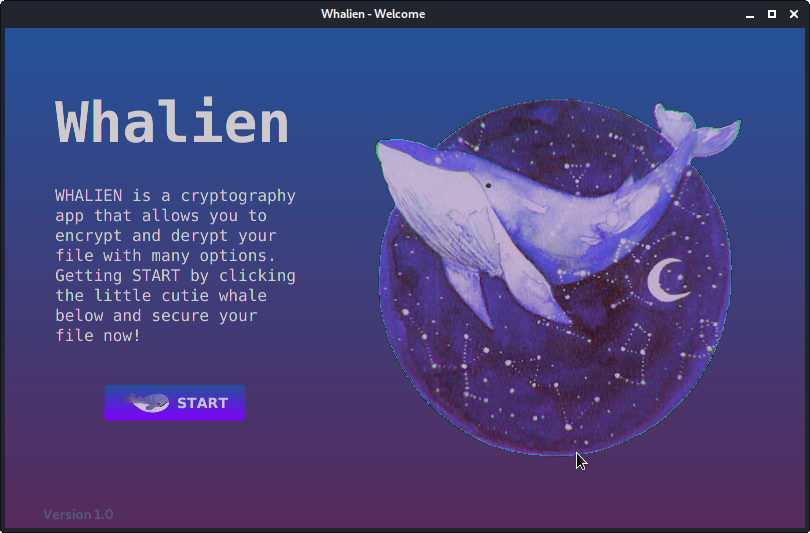
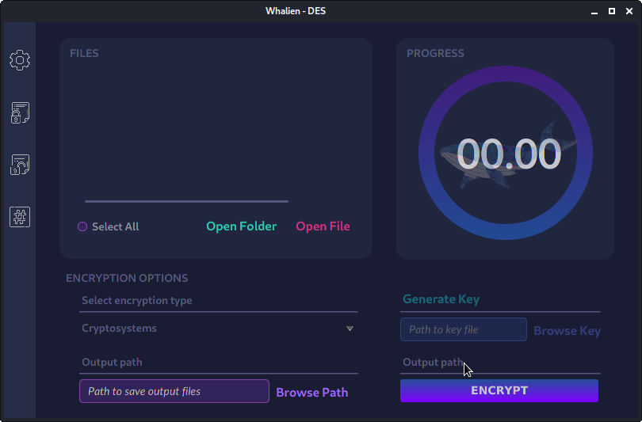
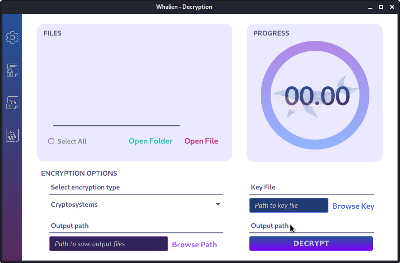
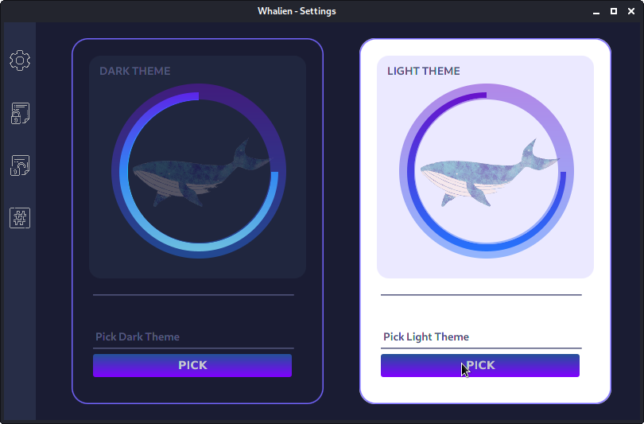

# AppWhalien

This project is built for the assignment of Cryptography and WebSec Course in HCMUT.

The UI is created with JavaFX and SceneBuilder (which make the process much easier).

The Welcome Landing Page

Dark Theme UI

Light Theme UI

Check Integrity of Files with MD5 hash

Pick your favourite theme :))

